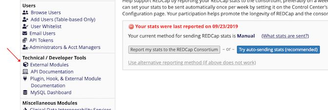
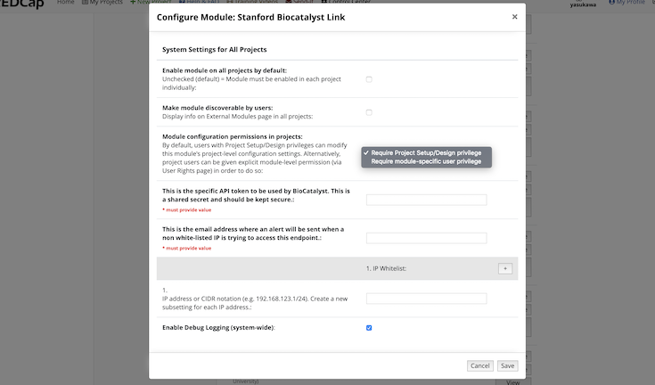
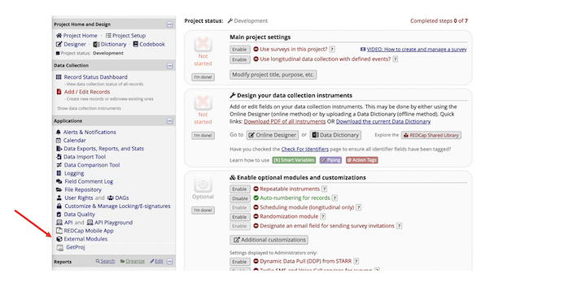
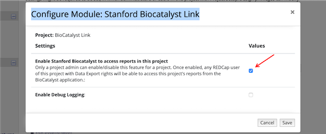

# BioCatalyst Link
This external module creates a single endpoint that can be used by outside users to access reports 
for many REDCap projects. The difference between using this External Module and using the REDCap
API call to 'Export Reports', is that this external module handles all data access to REDCap projects 
so the end user does not need an API token for each project that they want to retrieve data from. 

There are 2 security measures which allow control over access to these API requests. 

## Setup
The module must be enabled from the **REDCap Control Center**. 

#### System Parameters

Once the module is enabled for your REDCap instance, open the system configuration file and add
the system parameters neccesary to use this module. 

Note: Project level settings to allow access is also required.

There are only a few setup parameters that are required.  The two required setup parameters are:
1) Shared Token - token that is configured between the outside user and this External Module so this module will
know the requestor is a trusted user.

2) Alert email address - An email will be sent when a request outside the designated IP range is received. If an IP
range is not entered, no alerts will be sent.  For security reasons, we highly suggest IP ranges be used so
that tighter controls can be maintained over data stored in REDCap.

The optional data:
1) Valid IP Ranges - enter as many IP ranges where requests can originate from. This data is **not** required since
there may be instances where the IP ranges are not known or cannot be determined in advance.

2) Enable module on all projects by default - At Stanford, we enable this module on all projects by default
(checked option). Since access to reports from projects need an additional project-level checkbox, there is no
greater security risk to enable this module on each project. If this checkbox is **NOT** selected, a REDCap Administrator
will be required to enable this module on each project that chooses to allow this functionality.

3) Make module discoverable by users - If the module is not automatically enabled on each project, you can
select option so users can find the module but they will still need to request the module to be enabled for
their project from an Administrator.

#### Project Parameters
Once the system parameters are set, go to the REDCap project and select the External Module link. 

Open the Project Config File and select the Enable Stanford Biocatalyst to access reports in this project.

Setup is now complete.

## API Calls and Example Syntax
There are four POST calls that are supported with this module:

##### User Rights Request
This API call retrieves user rights 'Data Export Tool' and 'Reports and Report Builder' for each 
of the users in the list for each project enabled with this module. Since both user rights are required
in order to retrieve data, a check to ensure proper user rights should be performed before requesting data.
    
    Example request:
    {"token":"<shared token>", "request": "users", "user": "<sunetid1,<sunetid2>"}
    
    Example return:
    [
      {
        "user":"<sunetid1>",
        "projects": [
          {
            "project_id": "1",
            "project_title": "Project 1",
            "rights": {
              "data_export_tool": "1",
               "reports": "1"
            }
          },
          {
            "project_id": "2",
            "project_title": "Project 2",
            "rights": {
              "data_export_tool": "1",
              "reports": "1"
            }
        ]
      },
      {
        "user2": "<sunetid2>",
        "projects": [
          ...
        ]
      }
    ]
        
##### List of Reports Request
For a given project, the list of reports that a user has access to can be retrieved.
    
    Example request:
    {"user":"<sunetid>", "token":"<token>", "request":"reports", "project_id":"28"}

    Example return:
    {
        "project_id": 28,
        "reports": [
            {
                "report_id": "8",
                "title": "Report 1"
            },
            {
                "report_id": "9",
                "title": "Report 2"
            }
        ]
    }
     
##### Retrieve Report Data Request
To retrieve report data, users must have 'Data Export Tool' and 'Report and Report Builder' rights to the project.
Data can be retrieved in raw form or labelled form.  Raw form returns coded values for multi-choice fields and checkboxes
and labelled form retrieves the labels on the choices and checkboxes.

    Example request:
        For raw data:
        {"user":"<sunetid>", "token":"<token>","request":"reports","project_id":"28","report_id":"8","raw_data":"1"}
    
        Example return: 
        [
            {
                "study_id": "1",
                "first_name": "Test_First",
                "last_name": "Test_Last",
                "address": "asdfasdf",
                "telephone_1": "(415) 555-1212",
                "email": "xxxx@yyyy.com",
                "dob": "2018-08-02",
                "age": "1",
                "ethnicity": "2",
                "race": "5",
                "sex": ""
            }
        ]
        
        
        For labeled data:
        {"user":"<sunetid>", "token":"<token>","request":"reports","project_id":"28","report_id":"8"}
        
        Example return: 
        [
            {
                "study_id": "1",
                "first_name": "Test_First",
                "last_name": "Test_Last",
                "address": "asdfasdf",
                "telephone_1": "(415) 555-1212",
                "email": "xxxx@yyyy.com",
                "dob": "2018-08-02",
                "age": "1",
                "ethnicity": "Unknown / Not Reported",
                "race": "More Than One Race",
                "sex": ""
            }
        ]
    
    
##### Retrieve Column Metadata Request
The columns API can be used to retrieve metadata about each column in the specified report. The metadata fields
include: form_name, field_name, field_order, field_label, field_type, field_options and field_validation.

    Example request:
    {"user":"<sunetid>", "token":"<token>","request":"columns","project_id":"28","report_id":"8"}

    Example return: 
    {
        "report_id": 8,
        "project_id": 28,
        "user": "<sunetid>",
        "columns": [
            {
                "form_name": "demographics",
                "field_name": "study_id",
                "field_order": "1",
                "field_label": "Study ID",
                "field_type": "text",
                "field_options": null,
                "field_validation": null
            },
            {
                "form_name": "demographics",
                "field_name": "first_name",
                "field_order": "2",
                "field_label": "First Name",
                "field_type": "text",
                "field_options": null,
                "field_validation": null
            },
            {
                "form_name": "demographics",
                "field_name": "last_name",
                "field_order": "3",
                "field_label": "Last Name",
                "field_type": "text",
                "field_options": null,
                "field_validation": null
            },
            ...
        ]
    }

